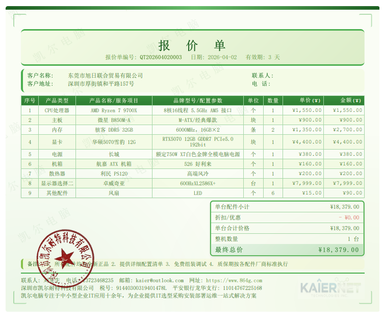
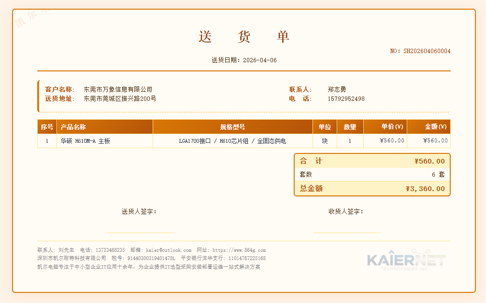

# 电脑店装机管理系统

> 某个下午手搓的装机管理系统，自己用得挺好的，应该是涵盖了这个行业大部分业务需求，平时有空就修修改改，现在基本完善了，就开源出来了。

如果你也是开电脑店、电脑公司、做IT服务的同行，希望这个项目对你有帮助。

---

## 🖥️ 在线演示

**演示地址：** https://www.980g.com

**演示账号：**
| 手机号 | 密码 |
|--------|------|
| 13800138000 | 13800138000 |

> ⚠️ 演示站数据为测试数据，定期清理，请勿存入真实业务数据。

---

## 📸 系统截图

> *(截图待补充)*

| 报价单 | 送货单 | 合同 |
|--------|--------|------|
|  |  |  |

---

## ✨ 功能模块

### 业务管理
- **报价管理** — 支持多套报价模板（弱电/强电/品牌机/组装机/方案报价），可盖章、隐藏价格、导出 Word/Excel/PDF，内置十套打印风格
- **方案管理** — IT解决方案文档管理，支持附件上传
- **合同管理** — 销售合同全生命周期管理，支持草稿/生效/完成/取消状态
- **送货管理** — 支持自送/快递/虚拟发货三种方式，可盖章、状态跟踪、收款记录
- **维修管理** — 维修工单全流程，支持上门/到店维修，记录配件、费用、工程师分成
- **财务管理** — 应收账款管理，收款记录追踪、可生成收据、收据风格多种可选带水印

### 基础数据
- **客户管理** — 客户档案，支持标签分类、支持导出导入
- **供应商管理** — 供应商档案管理、支持导出导入
- **产品管理** — 产品库，支持SKU、分类、采购管理销售出库管理、租借管理、序列号追踪、价格历史、支持导出导入
- **公章管理** — 电子公章上传管理，报价单/送货单/合同均可盖章

### 系统设置
- **用户管理** — 多用户，角色权限控制
- **系统设置** — 公司信息、报表页脚、水印、Logo 等配置
- **操作日志** — 系统操作记录
- **登录历史** — 记录登录 IP、时间

---

## 🎯 亮点

### 报价单多模板
针对IT行业不同业务场景设计了五套报价模板：
- 弱电工程报价
- 强电工程报价
- 品牌电脑报价
- 组装机报价（内置配件兼容性校验）
- 综合方案报价

### 组装机兼容性校验
组装机报价模板内置了 CPU/主板/内存/显卡的兼容性校验逻辑，选配件时自动提示不兼容项，这个功能花了不少时间，用着挺顺手的。

### 单据风格切换
报价单、送货单支持多套打印风格实时切换（经典黑白、商务蓝、暖橙金、少女粉等），切换后直接打印，客户看着也不一样。

### 电子公章
上传公章图片后，可在报价单/送货单/合同上拖拽盖章，打印时位置固定不偏移。

---

## 🛠️ 技术栈

- **后端：** PHP 7.4
- **数据库：** MySQL 5.7
- **Web服务器：** Nginx
- **运行环境：** Ubuntu 22
- **短信服务：** 腾讯云SMS（验证码登录）
- **前端：** 原生 HTML/CSS/JS，无框架依赖

---

## 🚀 部署说明

### 环境要求
- PHP 7.4+
- MySQL 5.7+
- Nginx 或 Apache

### 安装步骤

**1. 克隆项目**
```bash
git clone https://github.com/kaier0922/myerp.git
cd myerp
```

**2. 导入数据库**
```bash
mysql -u root -p 你的数据库名 < database.sql
```

**3. 配置数据库连接**

复制配置文件模板并修改：
```bash
cp config.example.php config.php
```

编辑 `config.php`，填入数据库连接信息：
```php
define('DB_HOST', 'localhost');
define('DB_NAME', '你的数据库名');
define('DB_USER', '数据库用户名');
define('DB_PASS', '数据库密码');
```

**4. 配置短信服务（可选）**

复制短信配置模板：
```bash
cp sms_config.example.php sms_config.php
```

编辑 `sms_config.php`，填入腾讯云短信的 SecretId、SecretKey 等信息。

**5. 设置文件权限**
```bash
chmod 755 uploads/
chmod 755 assets/
```

**6. 配置 Nginx**

参考以下配置：
```nginx
server {
    listen 80;
    server_name 你的域名;
    root /www/wwwroot/你的目录;
    index index.php;

    location ~ \.php$ {
        fastcgi_pass unix:/tmp/php-cgi-74.sock;
        fastcgi_param SCRIPT_FILENAME $document_root$fastcgi_script_name;
        include fastcgi_params;
    }

    # 禁止uploads目录执行PHP
    location ~* ^/uploads/.*\.(php|php5|phtml)$ {
        return 403;
    }
}
```

**7. 创建超级管理员**

在数据库执行：
```sql
-- 先生成密码hash（在服务器上执行）
-- php -r "echo password_hash('你的密码', PASSWORD_DEFAULT);"

INSERT INTO users (phone, password, nickname, role, status, created_at)
VALUES ('你的手机号', '上面生成的hash', '系统管理员', 'super_admin', 1, NOW());
```

---

## 📁 目录结构

```
myerp/
├── config.php              # 数据库配置（不上传）
├── config.example.php      # 配置模板
├── sms_config.php          # 短信配置（不上传）
├── sms_config.example.php  # 短信配置模板
├── auth_helper.php         # 权限验证
├── settings_helper.php     # 系统设置读取
├── index.php               # 工作台首页
├── login.php               # 登录/注册页
├── quotes.php              # 报价管理
├── quote_view.php          # 报价单查看/打印
├── contracts.php           # 合同管理
├── deliveries.php          # 送货管理
├── delivery_view.php       # 送货单查看/打印
├── repair.php              # 维修管理
├── finance.php             # 财务管理
├── customers.php           # 客户管理
├── suppliers.php           # 供应商管理
├── products.php            # 产品管理
├── seals.php               # 公章管理
├── settings.php            # 系统设置
├── users.php               # 用户管理
├── uploads/                # 上传文件目录
└── assets/                 # 静态资源
```

---

## 📋 更新日志

### 2026-04
- 新增验证码登录/注册
- 新增登录设备指纹记录
- 新增文件上传类型安全校验
- 完善用户权限管理

### 2026-03
- 送货单新增三种发货方式（自送/快递/虚拟发货）
- 报价单新增多套打印风格
- 完善公章拖拽定位逻辑

### 2025-12
- 新增组装机报价兼容性校验
- 新增序列号追踪功能
- 新增财务管理模块

---

## 📞 联系我

如果你在部署过程中遇到问题，或者有功能建议，欢迎联系：

- **电话 / 微信：** 13723468235
- **邮箱：** kaier@pc4g.com

如果这个项目对你有帮助，欢迎 Star ⭐

---

## 📄 开源协议

MIT License — 可自由使用、修改、分发，保留原作者信息即可。
